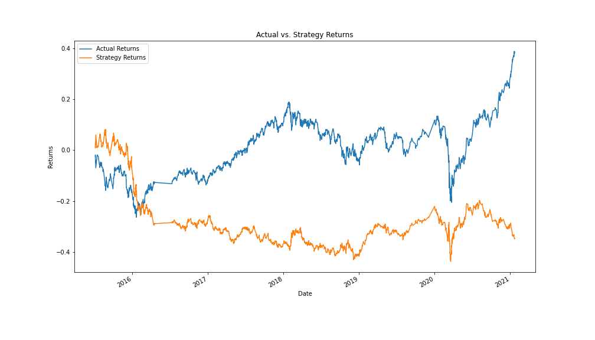
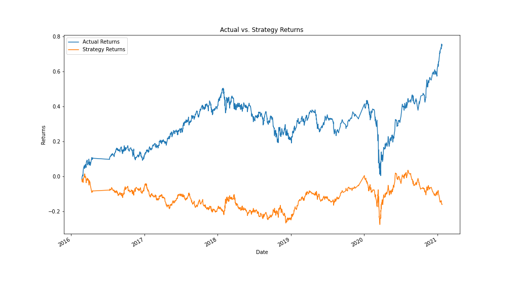

# 14-challenge
Challenge 14 for the Columbia FinTech Bootcamp

## Data
For this project, I used an open/high/low/close chart of emerging markets stock data. 

## Technologies
For this project, I used Python 3 with the following external libraries:
* pandas
  * tseries.offsets (DateOffset)
* numpy
* pathlib (Path)
* hvplot.pandas
* matplotlib.pyplot
* sklearn (svm)
  * preprocessing (StandardScaler)
  * metrics (classification_report)
  

## Question 1
Q: "Write your conclusions about the performance of the baseline trading algorithm...Support your findings by using the PNG image that you saved in the previous step." 

### Answer
The baseline trading algorithm performs poorly relative to the naive strategy of going long the asset. The strategy briefly outperformed until 2016, after which is returned about a cumulative -40% compared to +30% by just going long. The divergence began to significantly increase around mid-2020. See the chart below for further support to these claims. 

## Question 2
Q: "Tune the training algorithm by adjusting the size of the training dataset. To do so, slice your data into different periods. Rerun the notebook with the updated parameters, and record the results. Answer the following question: What impact resulted from increasing or decreasing the training window?"

### Answer
The first model (3 months of training) produced lackluster results, with the following classification report:

* -1.0:
  * Precision: 43%
  * Recall: 4%
* 1.0
  * Precision: 56%
  * Recall: 96%
* Overall Accuracy: 55%

It seems to basically just assume that every observation is 1.0, which explains why the recall is so high and the accuracy equals roughly the number of observations of 1.0 in the dataset.

I tried to fit a second model, this time increasing the length of the training period to 24 months, and unfortunately saw similar results.

* -1.0
  * Precision: 80%
  * Recall: 0%
* 1.0
  * Precision: 56%
  * Recall: 100%
* Overall Accuracy: 56%

The fact that the overall accuracy equals our precision for 1.0 clues us into the fact that the model, once again, cannot do better than predicting each observation as 1.0, despite the increased training time. Increasing the training window, therefore, had no impact on our model's predictive ability for the test set. 

## Question 3
Q: "Tune the trading algorithm by adjusting the SMA input features. Adjust one or both of the windows for the algorithm. Rerun the notebook with the updated parameters, and record the results in your `README.md` file. Answer the following question: What impact resulted from increasing or decreasing either or both of the SMA windows?"

### Answer
I will do this by increasing the first window to 20 periods, decreasing the second window to 50 periods, and adjusting the training time to 12 months. 

Results:

* -1.0
  * Precision: 0%
  * Recall: 0%
* 1.0
  * Precision: 56%
  * Recall: 100%
* Overall Accuracy: 56%

Again, our model just opted for the naive strategy of predicting every observation as 1.0. This is disappointing, given that I hoped that tuning parameters would yield some improvement. 

## Question 4
This strategy, as well, performed almost identically to the first strategy (see graph below). 

Overall, this model performed roughly in line with the first model, producing the following results:

* -1.0
  * Precision: 44%
  * Recall: 33%
* 1.0
  * Precision: 56%
  * Recall: 66%
* Overall Accuracy: 52%

While overall accuracy was reduced, recall on -1.0 increased and the model appeared to do a better job making predictions into both categories. That being said, the results are overall not much better than choosing randomly. On accuracy, this model performed worse than both the baseline model and the tuned trading algorithm.

## Evaluation Report
Summarizing the above conclusions and analysis: none of the models performed particularly well. The baseline model essentially just picked the most frequent class (Signal = 1). The tuned model explicitly just picked the most frequent class. The logistic regression model sacrificed accruacy for a more balanced choosing of classes, albeit while sacrificing accuracy and not performing all that much better than just randomly choosing classes.

